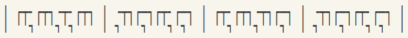
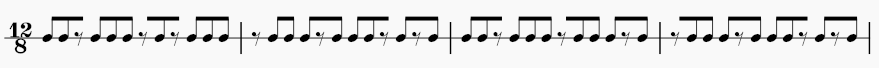

# Agrimotor

A script to help study the rhythms of the song [Agrimotor by Fredrik Thordendal](https://www.youtube.com/watch?v=c8badRqKgxA).

This script generates 3 text files, detailed below (all three are available in this repository).

Basics first: this song is in 12/8 (basically 4/4 but with three notes per beat), and is made of a series of riffs. All riffs consist of 8th note attacks (guitar hits) and 8th note rests. I’ll write attacks as `x` and rests as `-`.


## Attacks

`Agrimotor_attacks.txt`

This file contains the whole song as a basic list of attacks and attack groups, as a reference.
```
xx-xxx-x-xxx-xxx-xxx-x-xxx-xxx-xxx-x-xxx-xxx-x-…
2 3 1 3 3 3 1 3 3 3 1 3 3 1…
```

## Patterns

`Agrimotor_patterns.txt`

This file is the most interesting one. It contains the whole song condensed into a list of base patterns:
```
sL ssL ssL sL…
2 3 3 2…
```
Keep reading for explanations. (You can also check out [this reddit post](https://old.reddit.com/r/Meshuggah/comments/zq7ogv/agrimotor_patterns_cracked/) for even more detail, but it’s become obsolete).

The song is made out of two base patterns:  
**s** = `xx-x` (as in short)  
**L** = `xx-x-x` (as in Long)  

The song starts like this (bar lines added for readability):  
`|xx-xxx-x-xxx|-xxx-xxx-x-x|xx-xxx-xxx-x|-xxx-xxx-x-x|…`

If we rewrite this in terms of the two base patterns we get `sL ssL ssL sL…`:  
`|xx-xxx-x-xxx|-xxx-xxx-x-x|xx-xxx-xxx-x|-xxx-xxx-x-x|…`  
`|s...L.....s.|..s...L.....|s...s...L...|..s...L.....|…`

The song keeps going with a mix of several `s`s then an `L`. It seems natural to define longer patterns:  
**1** = `L` = `xx-x-x`  
**2** = `sL` = `xx-xxx-x-x`  
**3** = `ssL` = `xx-xxx-xxx-x-x`  
**4** = `sssL` = `xx-xxx-xxx-xxx-x-x`  
...

And with these longer patterns, the start of the song reduces to only **23 32**:  
`|xx-xxx-x-xxx|-xxx-xxx-x-x|xx-xxx-xxx-x|-xxx-xxx-x-x|…`  
`|s...L.....s.|..s...L.....|s...s...L...|..s...L.....|…`
`|2.........3.|............|3...........|..2.........|…`

Last, let’s just define a few variant patterns that will make the outro simpler:  
**L'** = `-x-x-x` = `L` but starting with a rest  
**2'** = `sL'`  
**3'** = `ssL'`

---

Then we can rewrite the whole song in terms of the longer patterns. Broken down into chunks of 8 or 16 bars (with timecodes for reference), we get this rather neat, compressed version of the song that shows the patterns it is made out of:

| Section                | Timecode | Patterns                            |
|------------------------|----------|-------------------------------------|
| *Intro*                | 0:06     | **23 32 32 23**                     |
|                        | 0:20     | **13 13 13 13 12**                  |
| *Verse 1*              | 0:33     | **124 124 124 124 124 12axx** (\*1) |
| *Descending riff \\m/* | 1:00     | **23 32 32 23**                     |
|                        | 1:13     | **32 23 36 1xx**                    |
| *Verse 2*              | 1:27     | **1 12424 124 12424 12aaa** (\*1)   |
| *Descending riff*      | 1:54     | **23 32 32 23**                     |
|                        | 2:07     | **32 23 36 1xx**                    |
| *Outro*                | 2:21     | **23' 32' 32' 23'** (\*2)           |
|                        | 2:34     | **23' 32' 32' 23'**                 |

(\*1) `12axx` and `12aaa` are just truncated versions of `124` at the end of the 16-bar cycle.

(\*2) The outro is actually just the same as the intro (`23 32 32 23`), but with rests on beat 3 of every bar:  
`|2.........3.|...... . .....|3...........|..2... . .....|…`  
`|s...L.....s.|..s... L .....|s...s...L...|..s... L .....|…`  
`|xx-xxx-x-xxx|-xxx-x X x-x-x|xx-xxx-xxx-x|-xxx-x X x-x-x|…` ← Intro  
`|xx-xxx-x-xxx|-xxx-x - x-x-x|xx-xxx-xxx-x|-xxx-x - x-x-x|…` ← Outro  
`|s...L.....s.|..s... L'.....|s...s...L...|..s... L'.....|…`  
`|2.........3'|...... . .....|3...........|..2'.. . .....|…`


## Text music sheet

`Agrimotor_music_sheet.txt`

This file makes use of some [unusual unicode characters](https://en.wikipedia.org/wiki/Box-drawing_character):

| Character | Used as                                             |
| :--------:|:--------------------------------------------------- |
| ╺         | beam start (rest)                                   |
| ┍         | beam start (note)                                   |
| ━         | beam middle (rest)                                  |
| ┯         | beam middle (note)                                  |
| ╸         | beam end (rest)                                     |
| ┑         | beam end (note) (also used as an 8th note rest)     |
| ╵         | hamp                                                |
| │         | bar line                                            |

The file contains the whole song’s rhythm as "sheet music" in 12/8. Something like:
```
  │ ┍┯╸┍┯┑╺┯╸┍┯┑ │ ╺┯┑┍━┑┍┯╸┍━┑ │ ┍┯╸┍┯┑╺┯┑┍━┑ │ ╺┯┑┍━┑┍┯╸┍━┑ │ ...
  │ ╵╵┑╵╵╵┑╵┑╵╵╵ │ ┑╵╵╵┑╵╵╵┑╵┑╵ │ ╵╵┑╵╵╵┑╵╵╵┑╵ │ ┑╵╵╵┑╵╵╵┑╵┑╵ │
```
which should look like this:



and is meant to emulate this:




## Generating the files

To generate the three text files, download Agrimotor.py, open a console and run ```python Agrimotor.py```. Tested with python 3.11, but it probably runs with earlier versions (≥ 3.6 for f-strings). Some parameters are customisable in the first few lines of the script, particularly:

- the number of bars per line in the music sheet file
- the sizes of chunks of bars to cut the song into, for the attacks and patterns files
